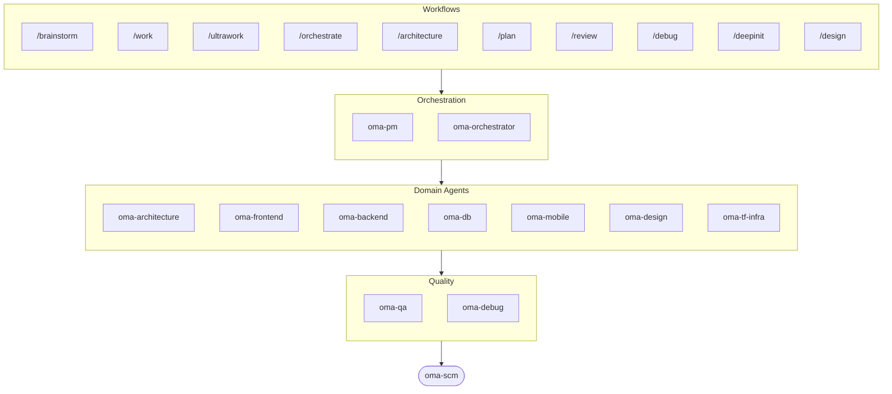

# oh-my-agent: Portable Multi-Agent Harness

[](https://www.npmjs.com/package/oh-my-agent) [](https://www.npmjs.com/package/oh-my-agent) [](https://github.com/first-fluke/oh-my-agent) [](https://github.com/first-fluke/oh-my-agent/blob/main/LICENSE) [](https://github.com/first-fluke/oh-my-agent/commits/main)

[한국어](https://github.com/first-fluke/oh-my-agent/blob/main/docs/README.ko.md) | [中文](https://github.com/first-fluke/oh-my-agent/blob/main/docs/README.zh.md) | [Português](https://github.com/first-fluke/oh-my-agent/blob/main/docs/README.pt.md) | [日本語](https://github.com/first-fluke/oh-my-agent/blob/main/docs/README.ja.md) | [Français](https://github.com/first-fluke/oh-my-agent/blob/main/docs/README.fr.md) | [Español](https://github.com/first-fluke/oh-my-agent/blob/main/docs/README.es.md) | [Nederlands](https://github.com/first-fluke/oh-my-agent/blob/main/docs/README.nl.md) | [Polski](https://github.com/first-fluke/oh-my-agent/blob/main/docs/README.pl.md) | [Русский](https://github.com/first-fluke/oh-my-agent/blob/main/docs/README.ru.md) | [Deutsch](https://github.com/first-fluke/oh-my-agent/blob/main/docs/README.de.md) | [Tiếng Việt](https://github.com/first-fluke/oh-my-agent/blob/main/docs/README.vi.md) | [ภาษาไทย](https://github.com/first-fluke/oh-my-agent/blob/main/docs/README.th.md)

Ever wished your AI assistant had coworkers? That's what oh-my-agent does.

Instead of one AI doing everything (and getting confused halfway through), oh-my-agent splits work across **specialized agents** — frontend, backend, architecture, QA, PM, DB, mobile, infra, debug, design, and more. Each one knows its domain deeply, has its own tools and checklists, and stays in its lane.

Works with all major AI IDEs: Antigravity, Claude Code, Cursor, Gemini CLI, Codex CLI, OpenCode, and more.

## Quick Start

```bash
# macOS / Linux — auto-installs bun & uv if missing
curl -fsSL https://raw.githubusercontent.com/first-fluke/oh-my-agent/main/cli/install.sh | bash
```

```powershell
# Windows (PowerShell) — auto-installs bun & uv if missing
irm https://raw.githubusercontent.com/first-fluke/oh-my-agent/main/cli/install.ps1 | iex
```

```bash
# Or manual (any OS, requires bun + uv)
bunx oh-my-agent@latest
```

### Install via Agent Package Manager

<details>
<summary>Microsoft's <a href="https://github.com/microsoft/apm">Agent Package Manager</a> (APM) — skills-only distribution. Click to expand.</summary>

> Not to be confused with `oma-observability`'s APM (Application Performance Monitoring).

```bash
# All skills, deployed to every detected runtime
# (.claude, .cursor, .codex, .opencode, .github, .agents)
apm install first-fluke/oh-my-agent

# A single skill
apm install first-fluke/oh-my-agent/.agents/skills/oma-frontend
```

APM reads `.claude-plugin/plugin.json`'s `skills: .agents/skills/` pointer, so the `.agents/` SSOT is the only source — no build step or mirror.

APM ships skills only. For workflows, rules, `oma-config.yaml`, keyword-detection hooks, and the `oma agent:spawn` CLI, use `bunx oh-my-agent@latest`. Pick one distribution per project to avoid drift.

</details>

Pick a preset and you're ready:

| Preset | What You Get |
|--------|-------------|
| ✨ All | Every agent and skill |
| 🌐 Fullstack | architecture + frontend + backend + db + pm + qa + debug + brainstorm + scm |
| 🎨 Frontend | architecture + frontend + pm + qa + debug + brainstorm + scm |
| ⚙️ Backend | architecture + backend + db + pm + qa + debug + brainstorm + scm |
| 📱 Mobile | architecture + mobile + pm + qa + debug + brainstorm + scm |
| 🚀 DevOps | architecture + tf-infra + dev-workflow + pm + qa + debug + brainstorm + scm |

## Your Agent Team

| Agent | What They Do |
|-------|-------------|
| **oma-architecture** | Architectural tradeoffs, boundaries, ADR/ATAM/CBAM-aware analysis |
| **oma-backend** | APIs in Python, Node.js, or Rust |
| **oma-brainstorm** | Explores ideas before you commit to building |
| **oma-coordination** | Manual step-by-step multi-agent coordination guide |
| **oma-db** | Schema design, migrations, indexing, vector DB |
| **oma-debug** | Root cause analysis, fixes, regression tests |
| **oma-design** | Design systems, tokens, accessibility, responsive |
| **oma-dev-workflow** | CI/CD, releases, monorepo automation |
| **oma-docs** | Reference integrity checks, diff-affected doc detection |
| **oma-frontend** | React/Next.js, TypeScript, Tailwind CSS v4, shadcn/ui |
| **oma-hwp** | HWP/HWPX/HWPML to Markdown conversion |
| **oma-image** | Multi-vendor AI image generation |
| **oma-mobile** | Flutter cross-platform apps |
| **oma-observability** | Observability router — APM/RUM, metrics/logs/traces/profiles, SLO, incident forensics, transport tuning |
| **oma-orchestrator** | Parallel agent execution via CLI |
| **oma-pdf** | PDF to Markdown conversion |
| **oma-pm** | Plans tasks, breaks down requirements, defines API contracts |
| **oma-qa** | OWASP security, performance, accessibility review |
| **oma-recap** | Conversation history recap and themed work summaries |
| **oma-scholar** | Academic research companion — literature search, peer review |
| **oma-scm** | SCM (software configuration management) — branching, merges, worktrees, baselines; Conventional Commits |
| **oma-search** | Intent-based search router with trust scoring — docs, web, code, local |
| **oma-skill-creator** | Authors and audits OMA skills in the SSL-lite format |
| **oma-tf-infra** | Multi-cloud Terraform IaC (Infrastructure as Code) |
| **oma-translator** | Natural multilingual translation |

## How It Works

Just chat. Describe what you want and oh-my-agent figures out which agents to use.

```
You: "Build a TODO app with user authentication"
→ PM plans the work
→ Backend builds auth API
→ Frontend builds React UI
→ DB designs schema
→ QA reviews everything
→ Done: coordinated, reviewed code
```

Or use slash commands for structured workflows:

| Step | Command | What It Does |
|------|---------|-------------|
| 0 | `/deepinit` | Bootstrap an existing codebase (AGENTS.md, ARCHITECTURE.md, `docs/`) |
| 1 | `/brainstorm` | Free-form ideation |
| 2 | `/architecture` | Software architecture review, tradeoffs, ADR/ATAM/CBAM-style analysis |
| 2 | `/design` | 7-phase design system workflow |
| 2 | `/plan` | PM breaks down your feature into tasks |
| 3 | `/work` | Step-by-step multi-agent execution |
| 3 | `/orchestrate` | Automated parallel agent spawning |
| 3 | `/ultrawork` | 5-phase quality workflow with 11 review gates |
| 3 | `/ralph` | Wraps `/ultrawork` in an independent verifier loop until criteria pass |
| 4 | `/review` | Security + performance + accessibility audit |
| 5 | `/debug` | Structured root-cause debugging |
| 5 | `/docs` | Documentation drift verify + sync via `oma-docs` |
| 6 | `/scm` | SCM + Git workflow and Conventional Commit support |

**Auto-detection**: You don't even need slash commands — keywords like "architecture", "plan", "review", and "debug" in your message (in 11 languages!) auto-activate the right workflow.

## CLI

```bash
# Install globally
bun install --global oh-my-agent   # or: brew install oh-my-agent

# Use anywhere (sorted alphabetically)
oma agent:parallel -i backend:"Auth API" frontend:"Login form"
oma agent:spawn backend "Build auth API" session-01
oma dashboard               # Real-time agent monitoring
oma doctor                  # Health check
oma image generate "cat"    # Multi-vendor AI image generation
oma link                    # Regenerate .claude/.codex/.gemini/etc. from .agents/
oma model:check             # Detect drift between registered models and live vendor lists
oma recap --window 1d       # Cross-tool conversation history recap
oma retro 7d --compare      # Engineering retrospective with metrics + trends
oma search fetch <url>      # Mechanical search with auto-escalating strategies
```

Model selection follows two layers:
- Same-vendor native dispatch uses the generated vendor agent definition in `.claude/agents/`, `.codex/agents/`, or `.gemini/agents/`.
- Cross-vendor or fallback CLI dispatch uses the vendor defaults in `.agents/skills/oma-orchestrator/config/cli-config.yaml`.

### Per-Agent Models

Set `model_preset` in `.agents/oma-config.yaml` to choose which AI models each agent uses:

```yaml
language: en
model_preset: antigravity   # claude-only | codex-only | gemini-only | qwen-only | antigravity

# Optional per-agent overrides
agents:
  backend: { model: openai/gpt-5.5, effort: high }
```

- `oma doctor --profile` — prints the per-role resolved model matrix
- Full guide: [`web/docs/guide/per-agent-models.md`](https://github.com/first-fluke/oh-my-agent/blob/main/web/docs/guide/per-agent-models.md)

## Why oh-my-agent?

> [Read why →](https://github.com/first-fluke/oh-my-agent/issues/155#issuecomment-4142133589)

- **Portable** — `.agents/` travels with your project, not trapped in one IDE
- **Role-based** — Agents modeled like a real engineering team, not a pile of prompts
- **Token-efficient** — Two-layer skill design saves ~75% of tokens
- **Quality-first** — Charter preflight, quality gates, and review workflows built in
- **Multi-vendor** — Mix Gemini, Claude, Codex, and Qwen per agent type
- **Observable** — Terminal and web dashboards for real-time monitoring

## Architecture



## Learn More

- **[Detailed Documentation](https://github.com/first-fluke/oh-my-agent/blob/main/docs/AGENTS_SPEC.md)** — Full technical spec and architecture
- **[Supported Agents](https://github.com/first-fluke/oh-my-agent/blob/main/docs/SUPPORTED_AGENTS.md)** — Agent support matrix across IDEs
- **[Web Docs](https://first-fluke.github.io/oh-my-agent/)** — Guides, tutorials, and CLI reference

## Sponsors

This project is maintained thanks to our generous sponsors.

> **Like this project?** Give it a star!
>
> ```bash
> gh api --method PUT /user/starred/first-fluke/oh-my-agent
> ```
>
> Try our optimized starter template: [fullstack-starter](https://github.com/first-fluke/fullstack-starter)

<a href="https://github.com/sponsors/first-fluke">
  
</a>
<a href="https://buymeacoffee.com/firstfluke">
  
</a>

### 🚀 Champion

<!-- Champion tier ($100/mo) logos here -->

### 🛸 Booster

<!-- Booster tier ($30/mo) logos here -->

### ☕ Contributor

<!-- Contributor tier ($10/mo) names here -->

[Become a sponsor →](https://github.com/sponsors/first-fluke)

See [SPONSORS.md](https://github.com/first-fluke/oh-my-agent/blob/main/SPONSORS.md) for a full list of supporters.


## Star History

[](https://www.star-history.com/#first-fluke/oh-my-agent&type=date&legend=bottom-right)


## References

- Liang, Q., Wang, H., Liang, Z., & Liu, Y. (2026). *From skill text to skill structure: The scheduling-structural-logical representation for agent skills* (Version 2) [Preprint]. arXiv. https://doi.org/10.48550/arXiv.2604.24026


## License

MIT
